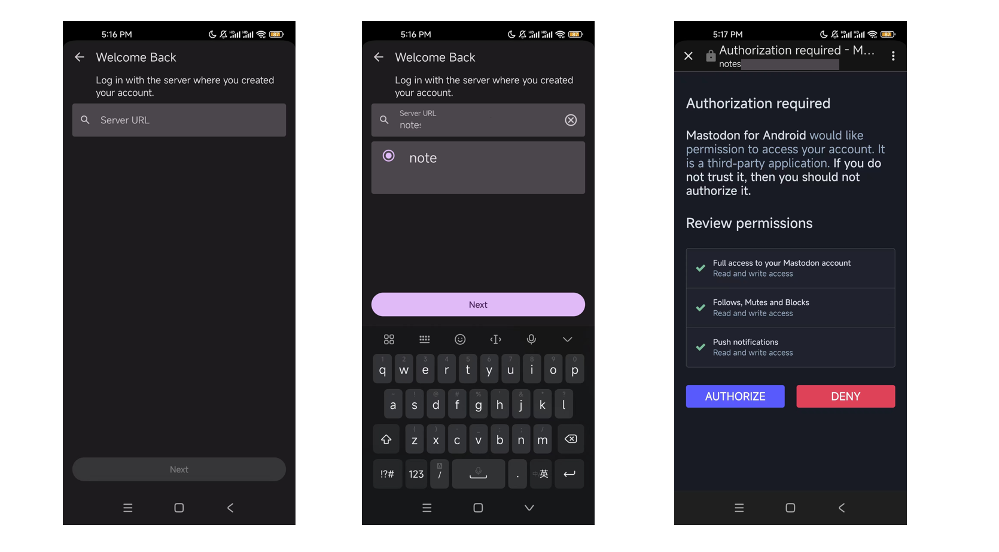

# 客户端应用

Castodon 支持多平台操作系统：Android, macOS, iOS, Windows 和 Linux, 以及移动智能设备和电脑的浏览器。

## 登录信息

不同的客户端应用和浏览器都基于以下 3 项进行登录：

* Server URL：服务器地址，服务提供者会在其自有渠道[^channels-own]发布该地址，比如春松部落的地址为 `tribe.cskefu.com`
* Username: 用户名
* Password: 密码

用户名和密码需要首先使用浏览器打开服务器的注册地址 `https://${SERVER_URL}/auth/sign_up`，注册需要一个使用者本人的、有效的邮箱。

> 比如，春松部落的注册地址为 [https://tribe.cskefu.com/auth/sign_up](https://tribe.cskefu.com/auth/sign_up)

## 会员订阅

**Castodon 服务的发帖和私信，需要购买会员订阅，否则注册后只能浏览信息**。购买会员订阅和绑定过程，目前只支持在浏览器中打开：[`https://${SERVER_URL}/memberships`](https://${SERVER_URL}/memberships)

> 比如，春松部落的会员订阅管理地址为 [https://tribe.cskefu.com/memberships](https://tribe.cskefu.com/memberships)

**在没有绑定有效的会员订阅证书[^valid-license]的情况下，登录不同客户端后，无法发帖和私聊。**

## 登录过程

具备了以上三项登录信息后，不同客户端的登录过程类似，以安卓 App 为例：

1. 打开应用，在首页点击【登录】
2. 进入新的页面填写服务器地址（Server URL，比如 `tribe.cskefu.com`），填写完成后，应用会检查该服务器是否有效
3. 选择目标服务器并点击【下一步】
4. 进入浏览器，这时候填写【用户名】和【密码】，服务器认证成功后进入下一页
5. 进入授权页面，点击【授权】确认
6. 授权后，自动返回到应用首页，后续关闭应用后，再次打开自动登录

是不是很简单，赶快下载应用开始使用吧！

## 下载链接

### Android

目前尚未在安卓应用商店上传，在安卓手机浏览器中，使用下面的链接下载 APK 后根据提示安装。

* apk [https://dwz.chatopera.com/007u81](https://dwz.chatopera.com/007u81)

### iOS

适配苹果移动客户端操作系统，iPhone，iPad.

[https://apps.apple.com/cn/app/tootoise/id1465090190?l=en-GB](https://apps.apple.com/cn/app/tootoise/id1465090190?l=en-GB)

或在苹果应用商店搜索：`tootoise`

### Linux

根据不同 Linux 发行版，下载对应的安装包，下载后双击或命令行进行安装。

* rpm [https://dwz.chatopera.com/ks5LE3](https://dwz.chatopera.com/ks5LE3)
* AppImage [https://dwz.chatopera.com/22QP95](https://dwz.chatopera.com/22QP95)
* deb [https://dwz.chatopera.com/V82hgy](https://dwz.chatopera.com/V82hgy)
* tar.bz2 [https://dwz.chatopera.com/5FC82M](https://dwz.chatopera.com/5FC82M)

### macOS/Mac OSX

适配苹果桌面操作系统，macOS, Mac OSX, etc.

* dmg [https://dwz.chatopera.com/OL9v81](https://dwz.chatopera.com/OL9v81)

### Windows

使用下面的链接下载软件安装包，根据提示安装。

* exe [https://dwz.chatopera.com/nao1f6](https://dwz.chatopera.com/nao1f6)

## 帮助

如使用客户端遇到问题时，[联系我们](/castodon-docs/docs/help)。

[^channels-own]: 服务提供方的自有渠道，比如某公司运营的微信公众号、官网等。
[^valid-license]: 有效的证书，是指在有效期内，还有剩余配额的证书。关于证书的介绍，参考示例 [春松部落会员订阅证书](https://store.chatopera.com/product/cstribe001)